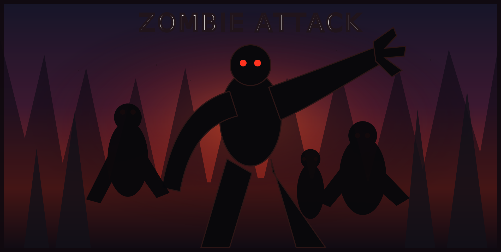

# Zombie Attack - iGraphics Game

<p align="center">
  
</p>

A 2D zombie shooting game built with **C/C++** and the **iGraphics** graphics library. The game includes animated zombies, player movement, shooting mechanics, health tracking, scoring, sound effects, menu screens, and a simple high-score system.

## Project Overview

**Zombie Attack** is an academic/game-development project created using the iGraphics framework. The player must survive against incoming zombies by shooting them before they reach the player. The game uses bitmap-based animations, keyboard controls, background movement, collision detection, health management, and score calculation to create a complete arcade-style survival experience.

## Features

- 2D zombie survival gameplay
- Player running, standing, shooting, and death animations
- Multiple zombie types with separate movement behavior
- Bullet firing and collision detection
- Health bar system
- Score and high-score tracking
- Menu, game-over, and instruction screens
- Background graphics and game assets
- Built with Visual Studio and iGraphics

## Technologies Used

| Technology | Purpose |
|---|---|
| C/C++ | Core game logic |
| iGraphics | 2D graphics rendering |
| OpenGL / GLUT | Graphics backend used by iGraphics |
| Visual Studio | Project build environment |
| BMP Assets | Character, zombie, button, and background images |

## Repository Structure

```text
Zombie-Attack-i-graphics/
├── iGraphics Project.sln
├── iGraphics Project/
│   ├── iMain.cpp
│   ├── iGraphics.h
│   ├── Variables.h
│   ├── SetFunction.h
│   ├── Debug/
│   └── assets / bitmap files
├── assets/
│   └── zombie-banner.svg
└── README.md
```

## How to Run

This project is mainly prepared for **Windows** with **Visual Studio 2013 / Visual Studio C++** and iGraphics.

### Basic Steps

1. Clone the repository:

```bash
git clone https://github.com/MostafizFahim/Zombie-Attack-i-graphics.git
```

2. Open the project folder.
3. Open `iGraphics Project.sln` in Visual Studio.
4. Make sure the iGraphics, GLUT, and required library files are properly configured.
5. Build the project in `Debug | Win32` mode.
6. Run the project from Visual Studio.

## Controls

| Key / Action | Function |
|---|---|
| Keyboard movement keys | Move/control the player |
| Mouse / keyboard shoot key | Shoot bullets |
| Menu buttons | Navigate through game screens |
| End / Exit option | Close the game |

> Exact controls may depend on the current implementation inside `iMain.cpp`.

## Common Setup Issues

### `iGraphics.h` not found

Make sure `iGraphics.h` is inside the project directory or properly included in Visual Studio include paths.

### GLUT / OpenGL linker error

Make sure the required `.lib` files are copied to the correct Visual Studio SDK library folder and linked with the project.

### Missing `.dll` file

If `glut32.dll` is missing, place it in the project output folder or in the correct Windows system directory.

### Images not loading

Keep the bitmap/image asset files in the same relative location expected by the source code. Do not rename asset folders unless the image paths are also updated in code.

## Game Concept

The main goal is simple: survive as long as possible while zombies approach from different directions. The player earns points by shooting zombies and loses health when zombies reach the player. The game ends when the player's health reaches zero.

## Future Improvements

- Add more zombie types and attack patterns
- Add levels with increasing difficulty
- Improve player controls and shooting mechanics
- Add better sound effects and background music
- Add pause/resume functionality
- Add a polished leaderboard system
- Convert the project to a modern C++/SFML or SDL version

## Author

**Mostafiz Fahim**  
GitHub: [MostafizFahim](https://github.com/MostafizFahim)

## License

This project is for academic and learning purposes. You can modify and improve it for your own practice.
